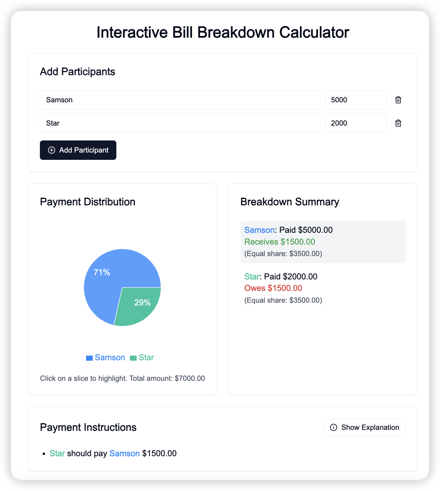
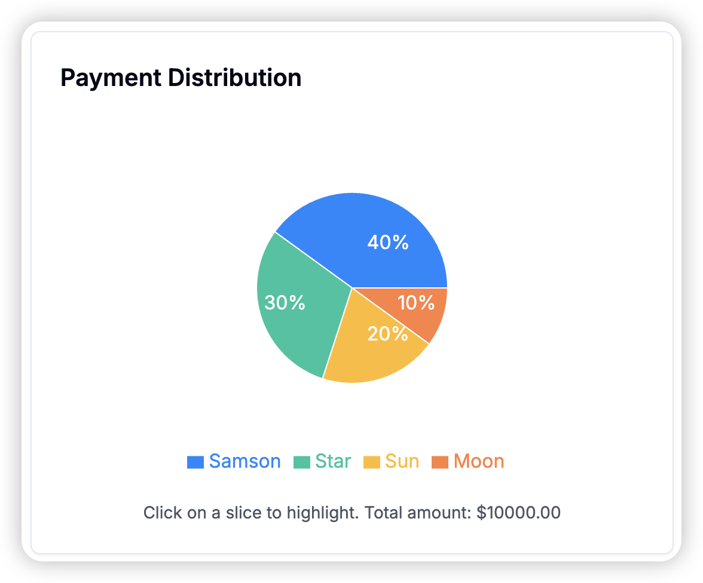
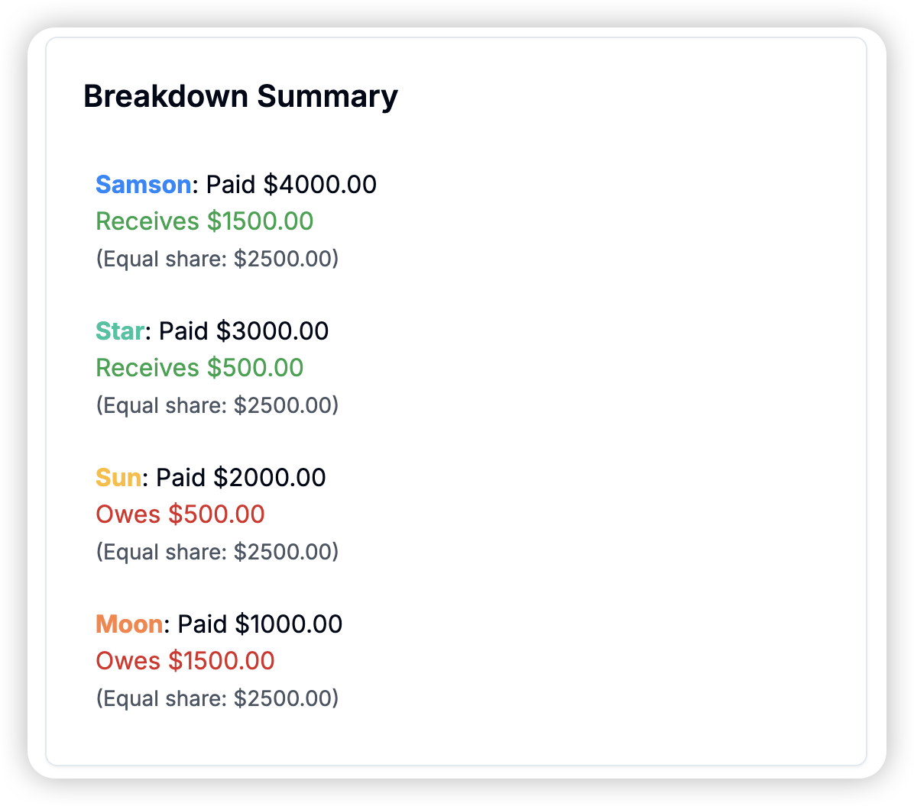
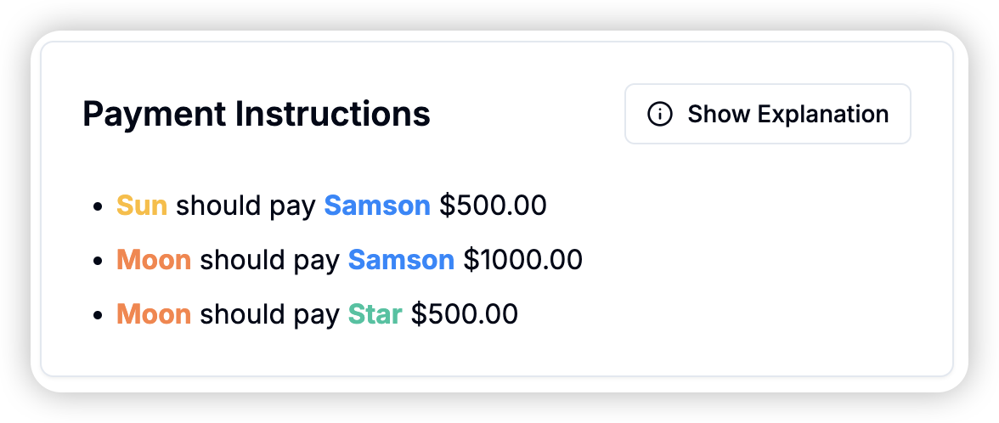

# Bill Breakdown Calculator

[Bill Breakdown Calculator Demo](https://interactive-bill-breakdown-calculator.vercel.app/)
# Bill Breakdown Calculator

[Bill Breakdown Calculator Demo](https://interactive-bill-breakdown-calculator.vercel.app/)

An interactive web application built with Next.js that helps groups easily split bills and calculate who owes what.
An interactive web application built with Next.js that helps groups easily split bills and calculate who owes what.

## Features

- **Add Multiple Participants**: Easily input names and amounts paid by each person.
- **Visual Breakdown**: See a clear pie chart representation of payments.
- **Detailed Calculations**: Get a breakdown of who owes what and who should be paid back.
- **Payment Instructions**: Receive step-by-step instructions for settling the bill.
- **Responsive Design**: Works seamlessly on desktop and mobile devices.

## Screenshots

### Home Screen


### Payment Distribution Chart
{: style="width: 50%;"}

### Breakdown Summary
{: style="width: 50%;"}

### Payment Instructions
{: style="width: 50%;"}

## Prerequisites

Before you begin, ensure you have met the following requirements:

- Node.js (v14 or later)
- npm (v6 or later)

## Installation

To install the Interactive Bill Breakdown Calculator, follow these steps:

1. Clone the repository:
   ```bash
   ```bash
   git clone https://github.com/samson10504/Interactive-Bill-Breakdown-Calculator.git
   ```

2. Navigate to the project directory:
   ```bash
   cd Interactive-Bill-Breakdown-Calculator
   ```bash
   cd Interactive-Bill-Breakdown-Calculator
   ```

3. Install the dependencies:
   ```bash
   ```bash
   npm install
   ```

## Usage

To run the Interactive Bill Breakdown Calculator, use the following command:

```bash
```bash
npm run dev
```

Then, open your web browser and navigate to `http://localhost:3000`.

## Tech Stack

- [Next.js](https://nextjs.org/) - React framework for production
- [React](https://reactjs.org/) - JavaScript library for building user interfaces
- [Recharts](https://recharts.org/) - Charting library built on React components
- [Tailwind CSS](https://tailwindcss.com/) - Utility-first CSS framework
- [Shadcn UI](https://ui.shadcn.com/) - Re-usable components built with Radix UI and Tailwind CSS

## Tech Stack

- [Next.js](https://nextjs.org/) - React framework for production
- [React](https://reactjs.org/) - JavaScript library for building user interfaces
- [Recharts](https://recharts.org/) - Charting library built on React components
- [Tailwind CSS](https://tailwindcss.com/) - Utility-first CSS framework
- [Shadcn UI](https://ui.shadcn.com/) - Re-usable components built with Radix UI and Tailwind CSS

## Contributing

Contributions to the Interactive Bill Breakdown Calculator are welcome. To contribute:

1. Fork the repository.
2. Create a new branch (`git checkout -b feature/AmazingFeature`).
3. Make your changes.
4. Commit your changes (`git commit -m 'Add some AmazingFeature'`).
5. Push to the branch (`git push origin feature/AmazingFeature`).
6. Open a pull request.

## License

This project is open source and available under the [MIT License](LICENSE).

## Deployment
This project is open source and available under the [MIT License](LICENSE).

## Deployment

This app can be easily deployed on [Vercel](https://vercel.com), the platform created by the makers of Next.js.
This app can be easily deployed on [Vercel](https://vercel.com), the platform created by the makers of Next.js.

[](https://vercel.com/new/clone?repository-url=https://github.com/samson10504/Interactive-Bill-Breakdown-Calculator)
[](https://vercel.com/new/clone?repository-url=https://github.com/samson10504/Interactive-Bill-Breakdown-Calculator)

